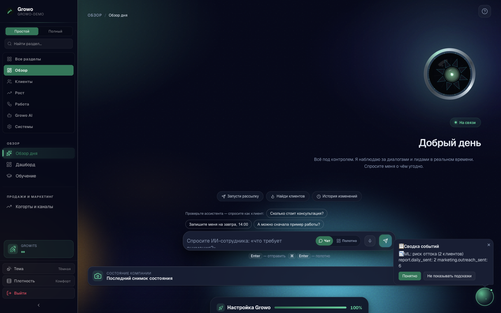
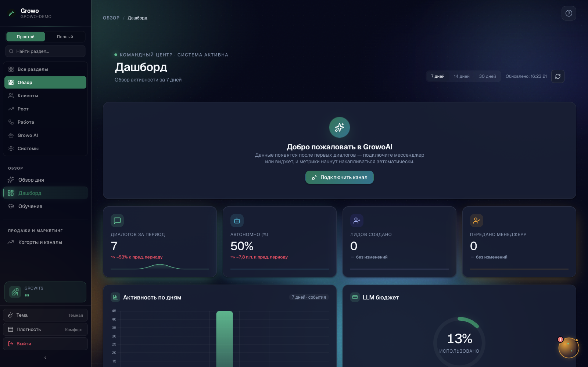
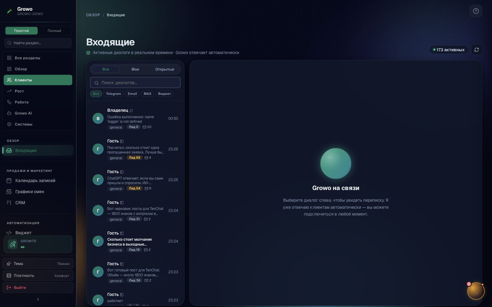
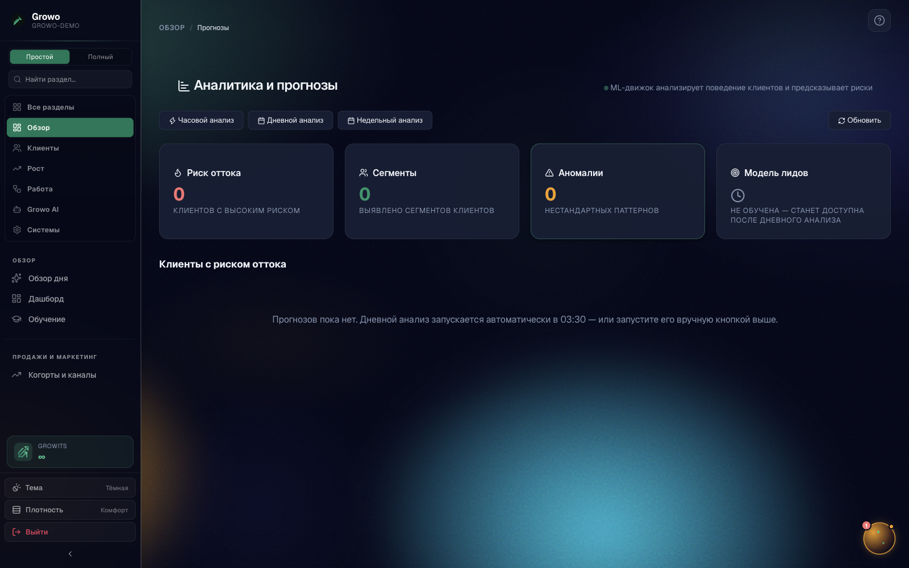
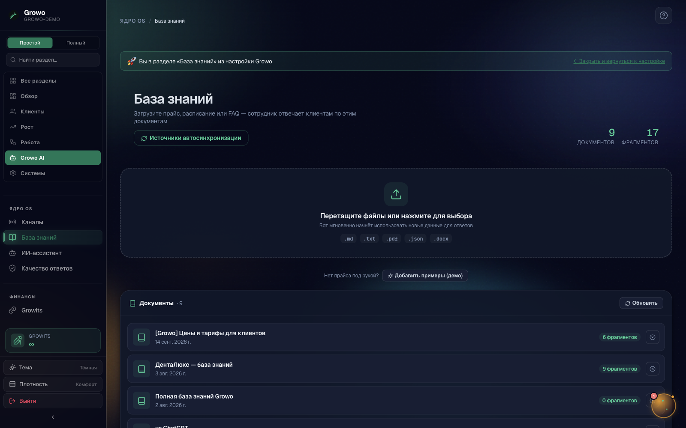
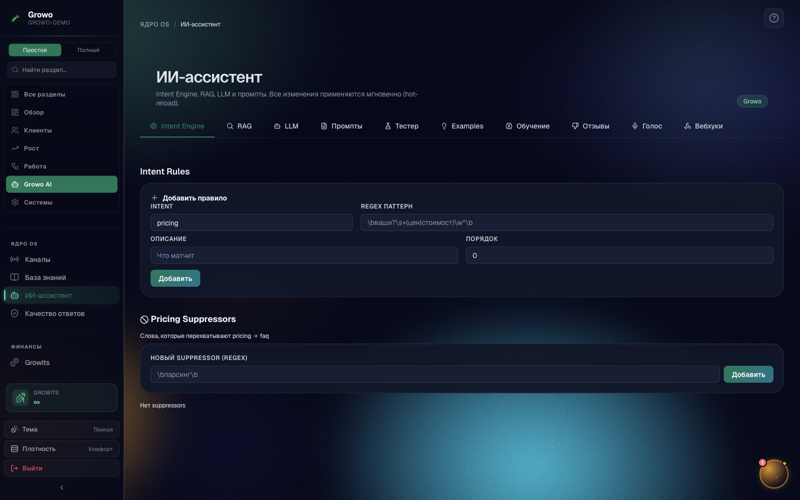
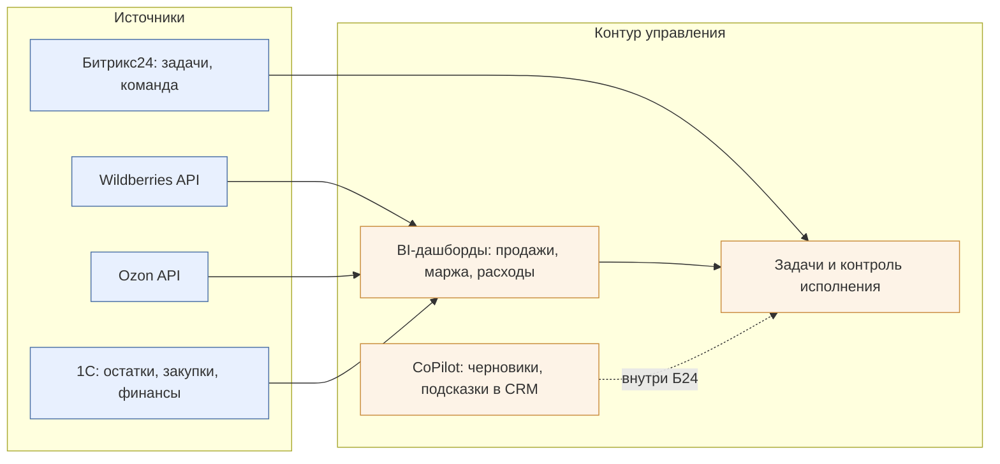

# Система управления бизнесом с ИИ — предложение для «Натурпласта»

**Автор:** Александр Юдин, архитектор ИИ-платформ (12+ лет в интеграциях и автоматизации, автор платформы Growo).
**Контекст задачи:** продажи на Wildberries/Ozon, стек 1С + Битрикс24 + сервисы аналитики МП. Цель — видеть состояние бизнеса, находить проблемы и возможности, принимать решения и контролировать исполнение.

---

## Ориентир 1 — Growo (опора: личный опыт, я автор платформы; скриншоты боевой системы)

**Что делает.** Growo — корпоративная AI-платформа «ИИ-офис» для SMB: единый контур «диалоги с клиентами → заявки → запись → CRM → аналитика». ИИ-агенты ведут переписку в 6+ каналах (виджет, Telegram, VK, MAX, Avito, почта), квалифицируют лиды, записывают на услуги, поднимают данные из базы знаний (RAG), выполняют бизнес-действия через 150+ инструментов (MCP): CRM-сделки, биллинг, документы. Всё, что делает агент и что с ним происходит, попадает в панель управления: входящие, дашборд, отчёты, прогнозы.

**Роль ИИ — не «чат-бот», а исполнительский контур:** ИИ встроен в три уровня: (1) диалог с клиентом 24/7 с доступом к базе знаний и бизнес-инструментам; (2) события и аномалии (лид без ответа, срыв SLA, падение конверсии) система превращает в задачи и уведомления; (3) HITL-согласование — агент предлагает действие, человек подтверждает в один клик, результат проверяется автоматически.

| Экран | Что на нём |
|---|---|
|  | «Обзор дня»: утренняя сводка по бизнесу для руководителя — что произошло, что требует внимания |
|  | Дашборд: воронки, каналы, конверсии, загрузка команды |
|  | Входящие: все диалоги ИИ-агентов, статусы, передача человеку |
|  | Аналитика и прогнозы |
|  | База знаний (RAG): документы компании — источник ответов агентов |
|  | Настройка ИИ-ассистента: персона, инструменты, ограничения |

Продукт: **growoai.ru** (работает в продакшене, мультитенантный SaaS + on-prem, 27 000+ автотестов).

**Что перенять «Натурпласту»:** (1) «Обзор дня» — ежедневная выжимка состояния бизнеса с действиями; (2) событийную модель «система нашла → предложила → человек согласовал → выполнила → проверила»; (3) HITL-принцип: ИИ предлагает, человек решает — это снимает страх «ИИ всё решит сам»; (4) единую панель вместо десяти вкладок маркетплейсов.

**Ограничения:** Growo заточен под коммуникационный контур (диалоги → заявки → CRM); контур «юнит-экономика МП + товарные остатки + 1С» там есть только как интеграции, глубокой аналитики WB/Ozon из коробки нет — это то, что пришлось бы доработать (см. мой вариант).

---

## Ориентир 2 — связка «Битрикс24 + CoPilot + BI» (опора: демонстрация продукта; у вас Битрикс24 уже есть)

**Что делает.** Битрикс24 с ИИ-помощником CoPilot: CRM + задачи + отдел продаж, ИИ подсказывает в карточках сделок, пишет черновики, собирает сводки. Как связка — обычно «Б24 (процессы/команда) + BI-дашборд (Yandex DataLens/PowerBI поверх 1С и API МП) + аналитика МП (MPStats/Маяк)». Роль ИИ здесь — ассистент внутри процессов, данные считает BI.

**Что перенять:** процессная дисциплина Б24 (задачи, ответственность, сроки) — «Натурпласту» она уже знакома; BI поверх 1С + API МП даёт «видеть состояние». **Ограничения:** ИИ здесь декоративен (черновики текстов), сквозного цикла «обнаружил проблему → предложил решение → согласовал → выполнил → проверил» нет; экономику МП (комиссии, логистика, реклама, выкуп) связка считает со скрипом и с ручной сверкой; воронка «инсайт → действие» разомкнута — решения принимает человек, читая десяток дашбордов.

Ссылки: bitrix24.ru (раздел CoPilot), cloud.yandex.ru/services/datalens, mpstats.io.

---

## Мой вариант для «Натурпласта»

**Принцип: не строить «ещё одну систему», а замкнуть контур управления вокруг ваших данных.** Что взять готовым, что доработать:

| Слой | Решение |
|---|---|
| Данные | Готовое: API WB/Ozon (продажи, комиссии, реклама, остатки), 1С (закупки/финансы). Доработка: ETL-сборка в единое хранилище с daily-обновлением |
| Аналитика | Готовое: BI (DataLens — дешёво и по-русски) для ручного взгляда. Доработка: расчёт юнит-экономики по SKU «до выкупа/после выкупа» |
| ИИ-контур | Доработка на базе подхода Growo: агент-«аналитик» поверх данных, который сам находит проблемы/возможности и предлагает решения |
| Исполнение | Готовое: задачи в вашем Битрикс24. Доработка: автосоздание задач из решений ИИ + автопроверка результата |

**Как пользуются.** Руководитель: утром — «Обзор дня» (5 минут: продажи/маржа/расходы/эффективность + 2–3 инсайта с кнопками «Принять решение»); днём — согласует предложенные ИИ действия в один клик. Сотрудники: живут в Битрикс24, как привыкли — им просто приходят корректно сформулированные задачи с контекстом и цифрами. Никто не обязан «общаться с ИИ» — ИИ встроен в существующие процессы.

**Сценарий «проблема → решение → согласование → выполнение → проверка» (реалистичный, еженедельный):**
1. **Обнаружение:** ИИ видит: «SKU X: маржа после выкупа упала с 18% до 6% за 2 недели — выросла доля возвратов и плата за хранение».
2. **Решение:** система предлагает: «Проверить карточку (фото/описание не соответствует размеру — 40% возвратов "не подошло") → задача контент-менеджеру; параллельно — снизить ставку рекламы на 20% до исправления».
3. **Согласование:** руководитель в «Обзоре дня» видит карточку проблемы с цифрами, жмёт «Согласовать» (или правит решение).
4. **Выполнение:** задача автоматически создана в Б24 с дедлайном, исполнитель приложил новую карточку.
5. **Проверка:** через 7 дней система сама сравнит возвраты/маржу до и после и пришлёт вердикт: «сработало / не сработало / нужно другое решение».

**Первый пилот (2 недели).** Берём **20 топ-SKU** и один контур: ежедневный сбор WB+Ozon → расчёт маржи после выкупа → «Обзор дня» руководителю + 2–3 проверенных инсайта в неделю с созданием задач в Б24.
**Критерий пользы:** (а) руководитель экономит ≥2 часа/нед на сводках; (б) минимум один инсайт, признанный командой «деньги» (найденная утечка маржи/точка роста) — измеряем в рублях.
**Главный риск:** качество исходных данных — если 1С и кабинеты МП расходятся в цифрах, доверию конец. Поэтому пилот начинается с двухдневной сверки методики расчёта маржи.
**Вопросы без ответа, без которых нельзя двигаться:** (1) кто владелец метрики «прибыльность» и как вы считаете её сейчас; (2) какие решения по товару реально принимает один человек или их несколько; (3) есть ли доступы к API кабинетов WB/Ozon и выгрузка из 1С; (4) что болит сильнее всего прямо сейчас — упущенные продажи, кассовые разрывы или хаос в задачах.

---

*Формат: 2 страницы. Скриншоты — боевая система Growo (демо-контур, данные обезличены). Готов показать живую систему на встрече и обсудить пилот.*
